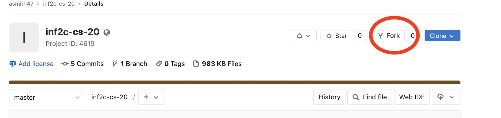
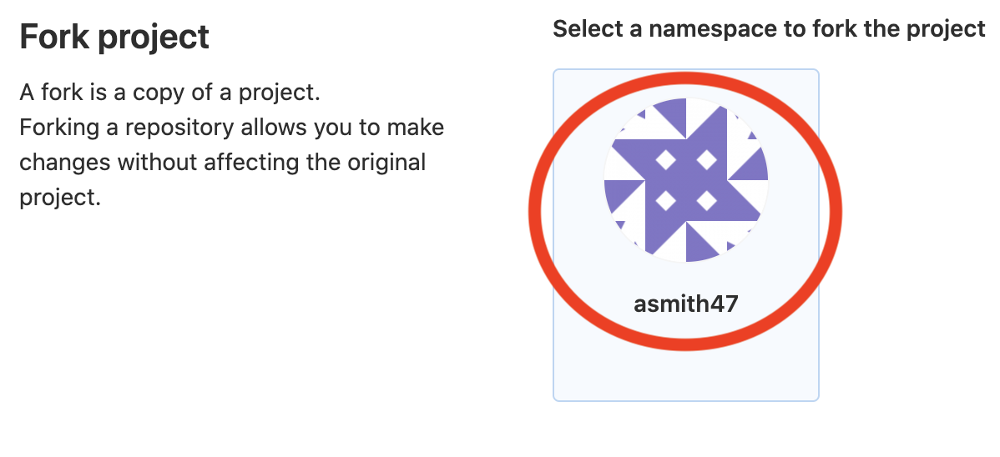
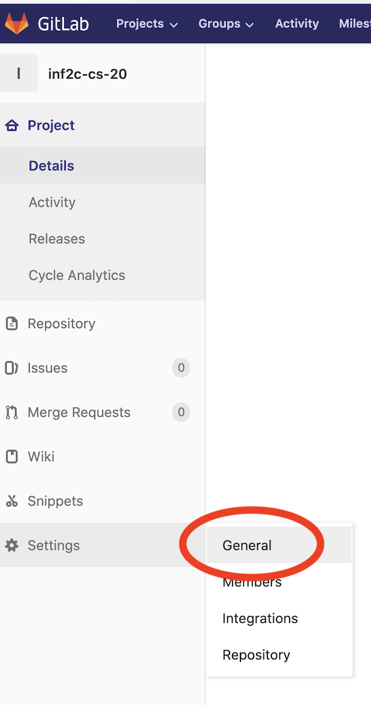
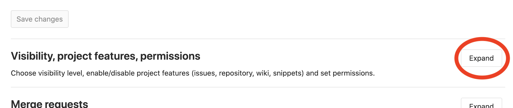
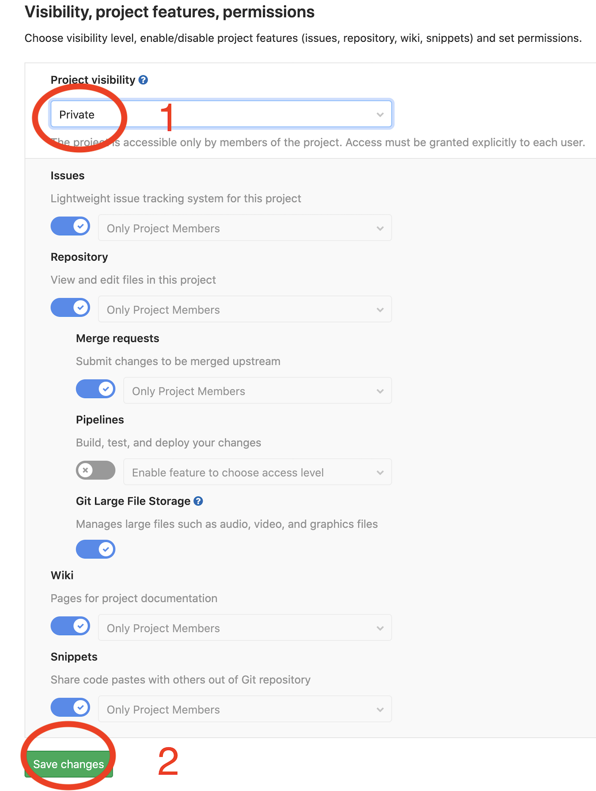
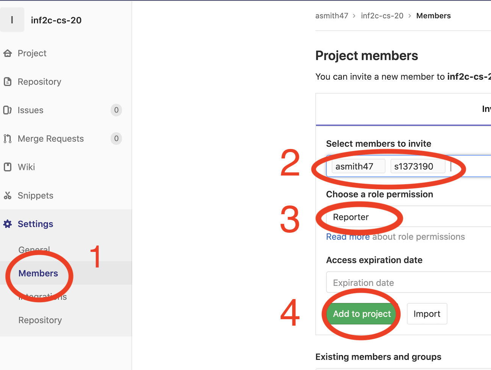

# Description of the course work is likely to be updated! #

Please note that the description of the course work might be updated from time to time to clarify things or fix mistakes.

# Scoreboard #
We will automatically run a series of hidden test inputs with your programs about twice a day. The scoreboard is provided as a best effort service, do not rely on it as it may come down unexpectedly: no guarantees are offered. 

[link to scoreboard be added soon]


# Marking #

The marking will be done using an automated script on a DICE machine using Java 8 (1.8 runtime). The marking will be a function of the number of successful tests that pass.


# Setup #

## Register your student id and name

First, we need you fill out [this google form](https://docs.google.com/forms/d/e/1FAIpQLSelKOz1yZZKaqFSd67Lq6i2KoHFGYd1BnyPWGGBue4ar4DylQ/viewform?usp=sf_link)
to help us register you for the automarking. If you are not registered, we won't be able to mark you. Also please make sure to keep `inf2c-cs-20` as your repository name, otherwise marking will fail.

## GitLab ##
It's mandatory to use GitLab for the coursework which is a DevOps platform based around the git revision control system. The university provides GitLab to all students. Use your univeristy id number (sXXXXXXX) for your username with your EASE password.

**Important** Do not share your code and repository with anyone else and keep your source code secret! If we identify that two students have identical portions of code, both will be considered to have cheated.


## Obtaining your own copy of the inf2c-cs-20 repository
We will be using the Git revision control system during the course. Git is installed on DICE machines and if you use your own machine then you may need to install Git.

You will need to have your own copy of the `inf2c-cs-20` repository. In order to fork this repository, click the fork button and follow the instructions below.






Then, make the repository private







Now, grant access to the teaching staff



You should grant the following users *Reporter* access:
  * Aaron Smith (username: asmith47)
  * Dmitrii Ustiugov (username: s1373190)  
  * Siavash Katebzadeh (username: s1691546)  
  * David Schall (username: s2033074)  

Next, you will have to clone the forked repository to your local machine. In order to clone the repository you should launch a terminal and type:

```
$ git clone https://sXXXXXXX@git.ecdf.ed.ac.uk/sXXXXXXX/inf2c-cs-20.git
```

where sXXXXXXX is your student id


## Working with Git and pushing your changes

Since we are using an automated marking system (based on how many tests work successfully with your coursework), it is important to understand how Git works. If you want to benefit from the nightly automatic marking feedback, please ensure that you push all your changes daily onto your GitLab centralised repository.

We suggest you follow the excelent [tutorial](https://www.atlassian.com/git/tutorials/what-is-version-control) from atlassian on how to use git. In particular you will need to understand the following basic meachnisms:

* [add and commit](https://www.atlassian.com/git/tutorials/saving-changes)
* [push](https://www.atlassian.com/git/tutorials/syncing/git-push)

